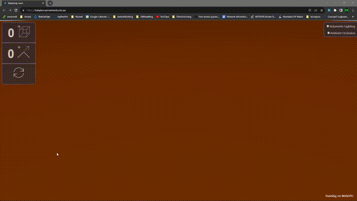

# Demonstration of Babylonjs app built with react 
## This app runs using WebGPU 
WebGPU is the soon to be the new standard for web-based graphic applications

If your browser or GPU is incompatible, the app will fallback to WebGL 

> WebGPU is an API that exposes the capabilities of GPU hardware for the Web. The API is designed from the ground up to efficiently map to (post-2014) native GPU APIs. WebGPU is not related to WebGL and does not explicitly target OpenGL ES.
>  - Sited from w3.org/TR/webgpu

further reading on WebGPU here at [mdn web docs](https://developer.mozilla.org/en-US/docs/Web/API/WebGPU_API)

## Visit Live Site at [https://babylon.secretnerd.com.au](https://babylon.secretnerd.com.au)

### This app is using Cloudflare Pages

│ Run the development server `npm run pages:dev`
│ Deploy your application `npm run pages:deploy`
│ Read the documentation `https://developers.cloudflare.com/pages`

Interacting with the 3D Scene
-----------------------------

This application comprises the following components:

-   Scene: The canvas where the magic happens, displaying the 3D cuboids.
-   Controls: User-friendly interface elements to manipulate cuboid dimensions and colors.

### Features and Interactions

-   Adjust Cuboid Dimensions:

    -   Use the input fields in the Controls panel to change the height, width, and length of the selected cuboid. Enter numeric values and see the cuboid transform in real-time with smooth animations.
-   Modify Cuboid Colors:

    -   Choose colors for the cuboid's boundary lines and faces using the color picker controls. 

-   Add and Remove Cuboids:

    -   Click the "Add" button in the Controls panel to add more cuboids to the scene. Select a cuboid by clicking on it; the UI controller will update to the selected cuboid. Use the "Remove Cuboid" button to delete the selected cuboid, excluding the original one.
-   Responsive Design:

    -   Experience seamless responsiveness as the scene adapts gracefully to different screen sizes, ensuring an optimal viewing experience on various devices.

### Bonus Features (Optional)

-   Advanced Lighting Effects:

    -   Marvel at the stunning ambiance created by advanced lighting effects like ambient occlusion and volumetric lighting, adding depth and realism to the scene.

-   Additional 3D Objects and Particles:

    -   Add a "cap" the scene that is a generated 2D shape that is extrueded at runtime

    -   Reset the scene to start over

